# Agricultural-advisory-services-and-Farmer-collaboration-system
Android and Firebase mobile application providing agricultural advisory services and farmer collaboration with the Department of Agriculture.
<h2>Introduction</h2>

The Internet of Things is a concept; it is a network, the true technology-enabled Network of all networks." — Edewede Oriwoh

We are now in world filled with new technologies and some are still emerging. In the current world almost, everything is connected to each other virtually because of the Internet.

In Sri Lanka, almost everyone is having smartphones that are connected to the internet. Then we realized that farmers are struggling to find solutions for the problems, especially regarding farming matters. Sometimes they may have to visit the Agricultural Departments' offices and stay in ques for several hours scarifying their valuable time in search of solutions to the problems. However, sometimes they may not get the solution after all dedications and/or farmers may have to wait for officer to visit the farming areas and give the solutions.

  
Considering all the facts we decided to give those innocent farmers who sacrifice their life for providing food required for all the people in the country. Since almost all the farmers (except for traditional ones) are having smartphones on their hand we decided to give them mobile-based application which can easily be accessed and used to contact the officers at any time without waiting in ques.

At the same time, the officers who are responsible for providing solutions to the farmers can use this application to address the farmer's problems easily. Based on the problem officers can provide solutions at the moment by using the app. But if it is not possible, they can contact the farmers and provide the solutions to the farmers.

  
App Name:
ChatAgro 

  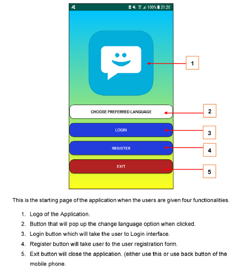

<h3>Expected benefits from the application to the Farmers</h3>

<ul>
  <li>Save the valuable time of the farmers.</li>
  <li>Use existing and familiar resources (Smartphone) rather than implementing new ones.</li>
  <li>Save the valuable time of the farmers.</li>
  <li>Provide solutions within less time period.</li>
  <li>Provide quality and easy functionality along with a better user experience.</li>
  <li>Satisfy the farmers and reduce their stress.</li>  
</ul>  

<h3>Expected benefits from the application to the Officers</h3>

<ul>
  <li>Improve the efficiency of solving problems.</li>
  <li>Provide solutions for the farmers within less time period.</li>
  <li>Can reduce the cost of papers.</li>
  <li>Easy to access the problems and solve them. </li>
 
</ul>  

<h2>Technical Specification</h2>

In the technical specifications, we will discuss the technicality of the application that we have developed. Almost all the smartphone users know that to use an application installed within the phone, it requires Internet access. The same scenario is applied here as well because "ChatAgro" application that we have developed is also fully online and Realtime app. Therefore, users need to make sure that they have connected to the Internet before using the application.

All the users are required to get registered with the application by using a valid email address along with duly filled user data. Once registered with the application user may have to verify the registered email address by clicking the link provided via email sent to the email address. If the user is verified and login details are correctly filled users will be taken to the application's main body. Note that if the user hasn't signed out from the application, the user will be taken automatically to the main body of the application every time the app opens.

There are three fragments in the main body named as Chats, Users, and Profile. Profile fragment will provide user's facilities to update their own profile, change the password, and to delete the account in the application. In the user's fragments, all the registered users of the application are view where a new chat can be created. At the chats fragment, it will display all the users who have had chats with along with the number of unread messages from each user. All the users are also given the caller facilities within the application if they want to clarify more regarding the solutions provided or to tell about the problem.

What the application actually does

  <ul>
  <li>Manage records of users and authenticate them with the application.</li>
  <li>Facilitates the users to reset the password if forgotten.</li>
  <li>Allow users to change their passwords whenever necessary.</li>
  <li>Users are allowed to update their user profiles.</li>
  <li>Post problem details and/or images to users (responsible).</li>
  <li>Provide solutions to the problems.</li>
  <li>Enable better communication among users via chats.</li>
</ul> 

In addition, we have provided a better usability experience by providing translation facilities between English, Sinhala, and Tamil languages. We have decided to use a translation facility in this app because we are mainly targeting the Sri Lankan.

Almost all the errors are handled in this application, therefore the application will be continued to run without causing any terminations. The application is well managed and secure, where the users are restricted from registering with the system by using fake email addresses. Because to continue with login the user must verify the email sent to the registered email address. Therefore, all in turn this application is highly concerned about customers' security as a result customers need not worry about the security of the data provided.

<h3>Target Users of the Application</h3>
<ul>
  <li>Sri Lankan Farmers.</li>
  <li>Officers in charge of providing solutions to agriculture-related problems in the Department of Agriculture.</li>
  <li>General public interested in Agriculture</li>
</ul>  

<h2>Screen Shots</h2>

Start Page

  

Change	LanguageOption
  

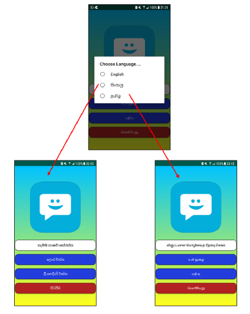

Registration Screen

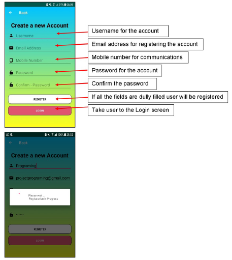

  

Create a new Account

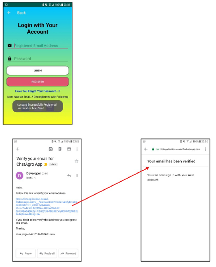

Login Screen

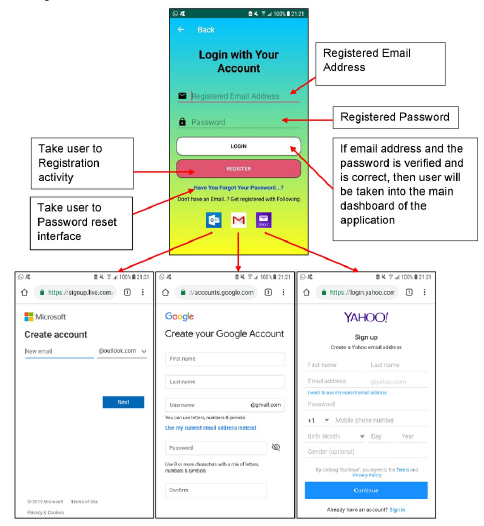

      

Reset Password
      

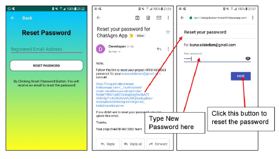

Main Dashboard of the ChatAgro

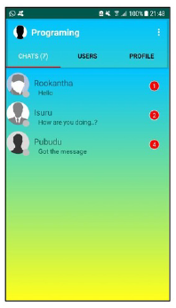

      

Search Users
      

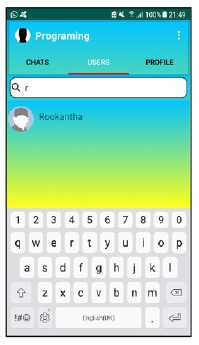

Update Profile

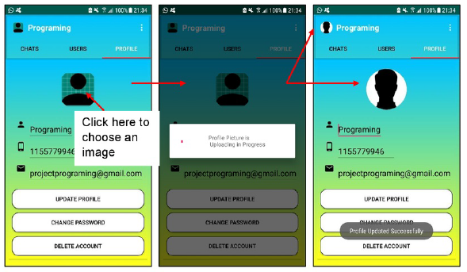

  

Delete Profile

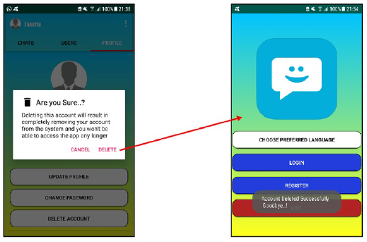
  

Sign Out

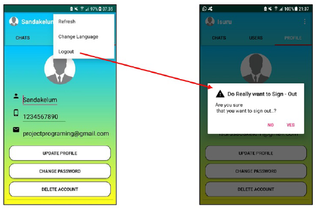

  

Message Interface

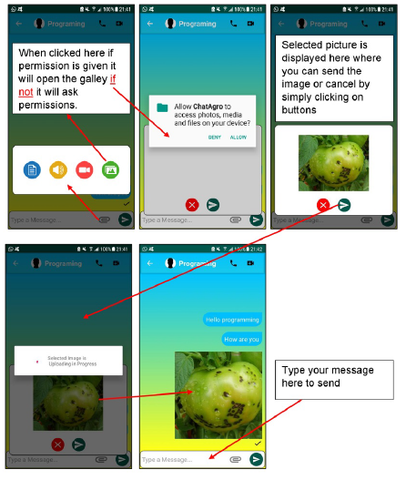
    
  

Delete Message

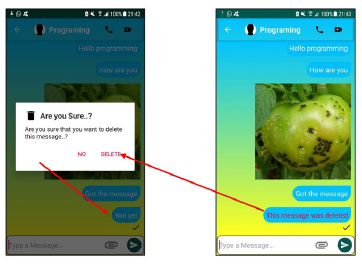
    

Delete Message

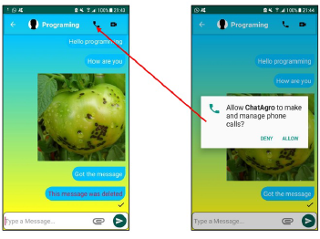

  
<h2>Database Model Used</h2>

As the data storage for the application we have decided to  use firebase database which is an online database provided by the google. This is very easy to use where the data is stored in the database as nodes not in table form. Firebase provides many facilities such as Authentications, Realtime database, Storage and more.

<h3>Firebase</h3>

Under the  authentication  function  provided  in  Firebase,  user  registration 	and verification will take place. This function handles email verifications, username (Email Address) and Password Management.

  
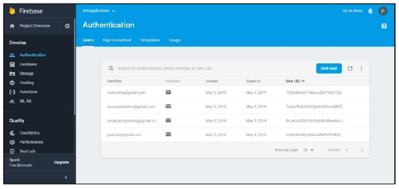

    

All the data and information send in the form of text from the application will be stored here. This is a real time database which reflects the changes made in the application data within a fraction of second.

  
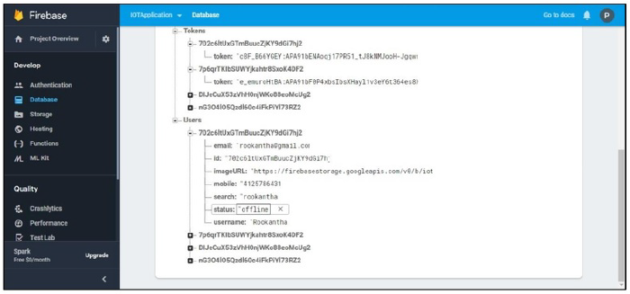

  
<h3>Cloud Storage</h3>

All the data and information send in the form of images from the application will 	be stored here. This is also real time storage which reflects the changes made within the application within a fraction of second (Note : according to the file size time may very)

  
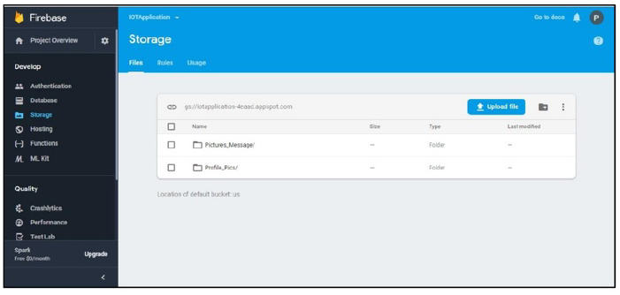

    
<h2>Usability Evaluations</h2>

Before uploading the "ChatAgro" application to the google play store we have tested the application for several hundreds of time. And also, we have distributed   beta version of the app among some of our class mates to test and give us their feedbacks. As a feedback summary, almost all said that application is perfect in functioning, attractive interfaces used and easy to use. But the only problem is that there is no facility given to upload videos. (Note: Video functionality will be discussed in the Future Implementations)

<h2>Future implementations</h2>

In the very near future we are planning to implement this application island wide with some developments and advancements. Since the current version only supports image and data processing, we are planning to implement a video processing as well in the future. Because videos can express detailed explanation than typing the descriptions a text box and posting a image of the problem. However video uploading and downloading may take several minutes depending on the file size and quality and also it will take lots of mobile data in sending video process.

And also, location sharing facilities will be embedded within the application in the future where the farmers can set their locations. So that the officers in the agricultural department can access those locations for further identification and clarification of problem. In the current context we have given the app completely free for the users and can only be used within android OS. However, in the future implementations we would provide the same application to IOS users.

<h2>Conclusion</h2>

As a summary we have developed an agricultural solution providing portrait application for android users. The application process, store, retrieve, update and delete data and information in real time. And also, the application is designed with attractive and eye-catching colors which will keep the users attracted towards the application. However, the "ChatAgro" application weight around 50MB because of its functionalities. Anyhow the application is fully functioning and have no errors. Overall, we as university undergraduates we think that we have achieved a great success in proving easy useable solution for our Sri Lankan farmers without imposing any charges on them.

  
  
  
  
